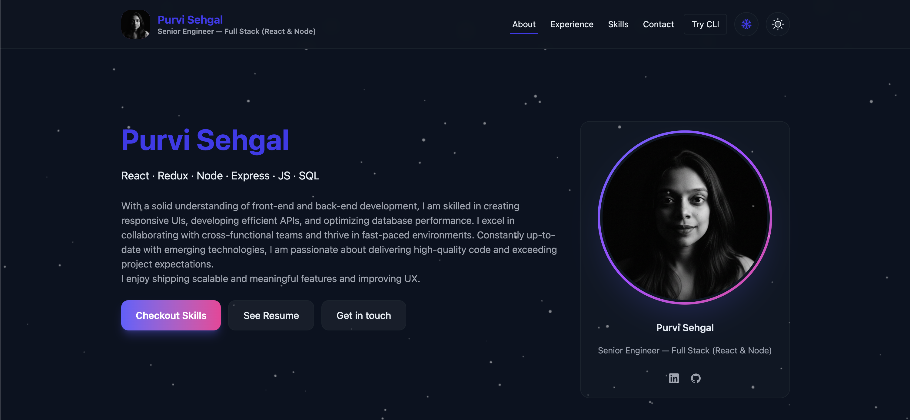

🔗 **Live Demo**: [LINK](LINK)

## 📸 Preview




## ✨ Features

- **Interactive Portfolio**: Showcase your projects with modal views and detailed descriptions
- **Dynamic Resume**: Interactive resume page with print functionality
- **CLI Resume**: Terminal-style resume interface for a unique user experience
- **Skills Visualization**: Circular progress bars and interactive skill displays
- **Theme Support**: Dark/Light theme toggle with smooth transitions
- **Smooth Animations**: Powered by Framer Motion for engaging UI interactions
- **Markdown Support**: Project descriptions rendered with GitHub-flavored markdown
- **Contact Form**: Interactive contact form for visitor inquiries
- **Responsive Design**: Fully responsive across all device sizes
- **Scroll Enhancements**: Progress bar and scroll-to-top functionality

## 🛠️ Tech Stack

### Core
- **React 19** - UI framework
- **TypeScript** - Type safety and better developer experience
- **Vite** - Fast build tool and dev server
- **React Router DOM** - Client-side routing

### Styling
- **Tailwind CSS 4** - Utility-first CSS framework
- **Framer Motion** - Animation library
- **Lucide React** - Icon library
- **React Icons** - Additional icon sets

### Additional Libraries
- **React Markdown** - Markdown rendering
- **React Circular Progressbar** - Skill visualization
- **React Scroll** - Smooth scrolling functionality
- **GitHub Markdown CSS** - GitHub-style markdown styling

## 📁 Project Structure

```
src/
├── components/          # Reusable UI components
│   ├── shared/         # Shared components (Header, Footer, etc.)
│   └── resume/         # Resume-specific components
├── pages/              # Page components
│   ├── PortfolioPage.tsx
│   └── ResumePage.tsx
├── config/             # Configuration files
│   └── portfolioData.ts
├── context/            # React contexts (Theme)
├── types/              # TypeScript type definitions
└── assets/             # Static assets
```

Built with ❤️ using React + TypeScript + Vite
